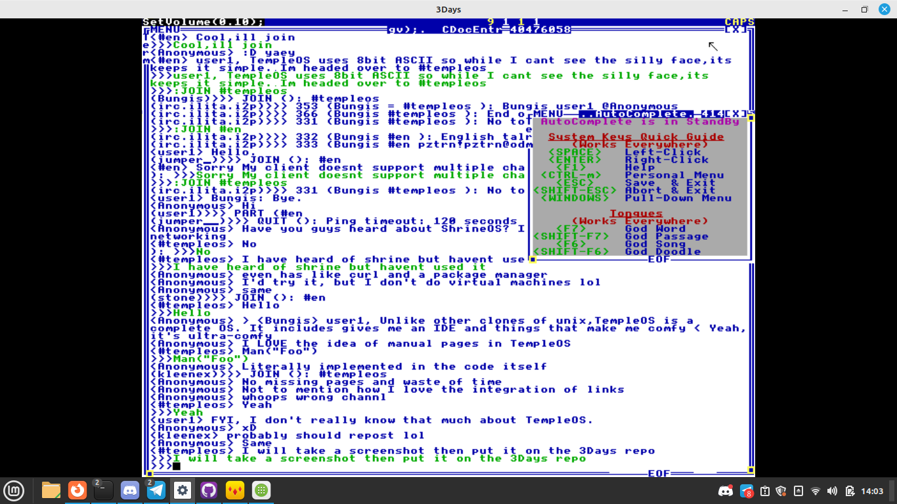
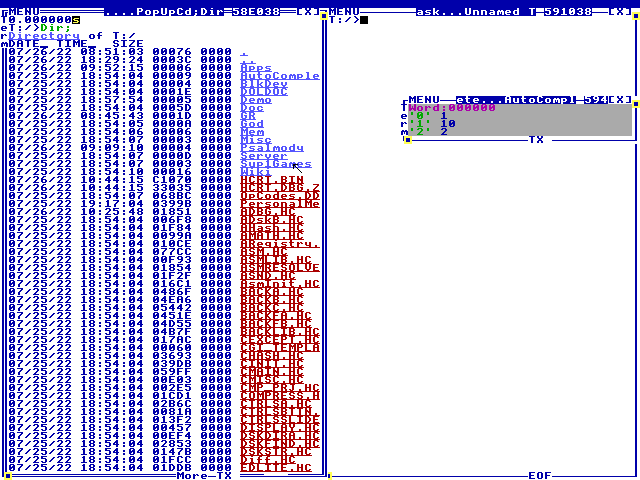
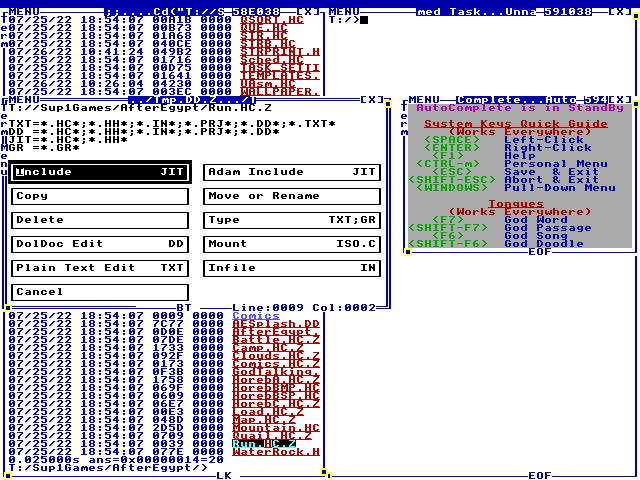

# Welcome to 3Days, a HolyC compiler
Welcome to 3Days,a HolyC Compiler for FreeBSD, Linux and Windows.

This contains a port of the TempleOS compiler from the original sources of TempleOS,along with other things like the DolDoc engine and Gr stuff.
To get started,you will need `tcsh`,`libsdl2-dev`,`portaudio19-dev` and `gcc` to build the stuff,which you can do by typing `make` on linux and `gmake` on FreeBSD.

# Development
This compiler has had a long history,it started out being written in C/yacc. I wasn't pleased with it so i rewrote it in HolyC. After I had a working HolyC compiler,I ported the TempleOS compiler to run under FreeBSD,which led to an easy port of the DolDoc engine. All dependencies (except for SDL2  and portaudio on unix) are included with this repo so building should not be a problem. 

To build the compiler binary `HCRT.BIN`,type `Cmp("FULL_PACKAGE.HC","HCRT.DBG.Z","HCRT.BIN");` in 3Days in the root directory of `T:` There is a booting process though, `KERNELA.HH` contains the functions that aren't linked to assembler symbols,but `KERNELB.HH` contains functions linked to assembler symbols. They are loaded in `FULL_PACKAGE.HC`
 

# News

 - I added user-login stuff to the server(edit your admin emails at T/Server/run.HC). Default user name is `root` with password `root`.
 - I added an IRC client that i wrote,use `:JOIN #channel`



# HolyC Caveats
## 1: Lvalues can be typecasted
```c
U8 *x=NULL;
x(I64*)++;
x==8; //I64 is 8 bytes wide
```
## 2: Inheritance
```c
class abc {
    I64 a,b,c;
};
class abcdef:abc {
    I64 d,e,f;
};
abcdef six={'a','b','c','d','e','f'};
```
## 3: Weird for statements
Don't put declarations in for statements
```c
for(I64 dont_do=0;;dont_do++) //Invalid code
    ...;
```
Instead do this
```c
I64 x=0;
for(x=0;x!=10;x++)
    "%d\n",x;
```

# Getting Started
Welcome to the world of TempleOS, you should see 2 terminals. You can type into them for fun. Try typing `Dir;` to get a directory listing. You will probably see the (HolyC) source files for 3Days. 



TempleOS allows you to click the files or folders. Try clicking `Sup1Games` or `Cd("Sup1Games");`to go into a folder and type `Dir;` to see the contents.

Inside the directory you should see `AfterEgypt`,in that folder should be lots of files. You can run of file by `#include "Run.HC.Z"` or by right clicking it and pressing the include button(left clicking will open it's source code in a editor). 



# Tips
 * You can press `ctrl+m` to get the personal menu,this will give you some links(not all are implemented at the moment).

# Documentation
I added some network support in the form of a partial `Dyad` binding,which is demostrated in `/Server`. It is a wiki server with help on using 3Days.
You can run it via the `run.HC` in that folder,and connect to `localhost:8080`.

This wiki is incomplete,but you can always help to change that. Maybe one day I will host a global version of it.

# Getting Started
## Command-Line
The first thing you may want to do while typing in the examples is put them into a file. Type `Ed("File.HC");` to make a new file,or edit an existing one. Once you are done press escape to finish exiting,or press `F5` to run the file.

You can make a folder via `DirMk("folder");`. You can List the contents of your current folder with `Dir;`. To move to another folder,you can do `Cd("folder");`. If you want to move to the parent folder, type `Cd("..");` (the `..` means parent folder).

If you loose a file, you can type `Find("some text");` to find it, if you have an idea of it's filename, you can type `FF("file.*");` to find it.
The `*` is a wildcard(like linux's). This will match `file.TXT`, or `file.HC`,or anything else

TempleOS will automatically compress any file ending in `.*.Z` for you, where `*` is any extension. If you want to uncompress them for sharing you can type `Unzip("file.HC.Z");`, or if you want to do the opposite you can type `Zip("file.HC");`

## Graphics(1)
Graphics are the super sauce of TempleOS. There are typically done though the `Fs->draw_it` member.
Let's see an example:
```c
 U0 DrawIt(CTask *,CDC *dc) {
   dc->color=BLUE;
   GrRect(dc,0,0,100,100);
 }
 Fs->draw_it=&DrawIt;
```
The window manager will call this method about 30 times a second to draw a blue rectangle.

There are other graphics functions as well:
```c
 U0 DrawIt(CTask *,CDC *dc) {
   dc->color=BLUE;
   GrLine(dc,0,0,100,100);
   GrCircle(dc,100,100,50);
   dc->color=RED;
   GrFillCircle(dc,0,0,,50);
   GrPlot(dc,100,100); //Single point
   GrRect(dc,200,200,100,100);
   dc->color=YELLOW;
   GrPrint(dc,0,0,"Hello %s","World");
 }
 Fs->draw_it=&DrawIt;
```
You can create your own Drawing Contexts(`CDC`) with `DCNew(width,height)`
```c
 CDC *new=DCNew(100,100);
 DCClear(new); //Clear our new CDC with black
 new->color=CYAN;
 GrRect(new,0,0,50,50);
```
You can use GrBlot to draw it to the screen.
```c
 U0 DrawIt(CTask *,CDC *dc) {
     GrBlot(dc,100,100,new);
 }
 Fs->draw_it=&DrawIt;
```
## Graphics(2,the 3D stuff)
TempleOS allows you to use matrix transformations. These transformations can be manipulated with some functions, but first we need to set the `DCF_TRANSFORMATION` flag on the `CDC`.
Let's see an example.
```c
 CDC *dc=DCNew(100,100);
 dc->r=Mat4x4IdentNew;
 DCFill;
 dc->flags|=DCF_TRANSFORMATION;
 F64 rotx=0;
 for(;rotx<=2*pi;rotx+=(2*pi/100.)) {
 	 DCFill(dc);
     Mat4x4IdentEqu(dc->r); //Reset our transformation
     Mat4x4RotZ(dc->r,rotx);
 	 Mat4x4TranslationEqu(dc->r,50,50,0);
  	 dc->color=YELLOW;
     GrRect3(dc,0,0,0,50,50);
     DCFill;
     GrBlot(,100,100,dc);
     Sleep(33);
 }
 DCDel(dc);
 DCFill;
```
There is a way to have a depth buffer,use `DCDepthBufAlloc(CDC*)` (be sure to reset it each call with `DCDepthBufRst`). 
```c
 CD3I32 poly[4]= {{-100,-100,-100},{100,-100,-100},{100,100,-100},{-100,100,-100}};
 I64 colors[4]= {BLUE,YELLOW,GREEN,CYAN};
 CDC *dc=DCNew(200,200);
 dc->r=Mat4x4IdentNew;
 DCDepthBufAlloc(dc);
 DCFill;
 dc->flags|=DCF_TRANSFORMATION;
 F64 rotx=0,roty;
 CD3I32 cube[6][6];
 I64 i=0,i2=0;
 I64 *trans=Mat4x4IdentNew; 
 for(rotx=0.; rotx<=(2.*pi)-1.; rotx+=2*pi/4.) {
     //Mat4x4TranslationEqu(trans,50,50,50);
     Mat4x4IdentEqu(trans);
     Mat4x4RotX(trans,rotx);
     Mat4x4RotY(trans,roty);
     for(i2=0; i2!=4; i2++) {
         MemCpy(&cube[i][i2],&poly[i2],sizeof(CD3I32));
         Mat4x4MulXYZ(trans,&cube[i][i2].x,&cube[i][i2].y,&cube[i][i2].z);
     }
     i++;
 }
 for(rotx=0; rotx<=2*pi; rotx+=(2*pi/100.)) {
     DCFill(dc);
     DCDepthBufRst(dc);
     Mat4x4IdentEqu(dc->r);
     Mat4x4RotX(dc->r,rotx);
     Mat4x4RotY(dc->r,rotx);
     Mat4x4RotZ(dc->r,rotx);
     Mat4x4Scale(dc->r,.5);
     Mat4x4TranslationEqu(dc->r,0,0,100);
     for(i2=0; i2!=6; i2++) {
         dc->color=colors[i2];
         GrFillPoly3(dc,4,cube[i2]);
     }
     DCFill;
     GrBlot(,100,100,dc);
     Sleep(33);
 }
 DCDel(dc);
 DCFill; 
```
**BUT WAIT**, we need to make it so if something is farther away from the camera, it get's smaller. Luckily we can use `CDC.transform` to do this. This function will take 3 points and move them.
```c
 #define SCRN_SCALE 512
 U0 Transform(CDC *dc,I64 *x,I64 *y,I64 *z)
 {
   I64 zz;
   Mat4x4MulXYZ(dc->r,x,y,z);
   zz=SCRN_SCALE/3+*z;
   if (zz<1) zz=1;
   *x=SCRN_SCALE/2* *x/zz;
   *y=SCRN_SCALE/2* (*y)/zz;
   *x+=dc->x;
   *y+=dc->y;
   *z+=dc->z;
 }
 //Add this after you create the CDC*
 dc->transform=&Transform;  
 dc->flags|=DCF_TRANSFORMATION;
```
## Graphics(Raster Operations!!!)
Colors can be dithered to create a shading effect. Here's an example that makes sort of an orange color:
```c
 CDC *dc=DCAlias;
 I64 cnt;
 for(cnt=0;cnt!=100;cnt++) { 
     dc->color=LTRED+YELLOW<<16+ROPF_DITHER;
     GrRect3(dc,0,0,0,100,100);
     Refresh;
  DCFill;
 }
```
There is a second kind of dither operation that you can use to make a cool effect. Its called `ROPF_PROBABILITY_DITHER` (you can set the probability of the shading using `dither_probability_u16`). It gets wacky with primitive operations, so use `GrFloodFill`
```c
 CDC *dc=DCAlias;
 I64 cnt;
 for(cnt=0;cnt!=100;cnt++) {
     dc->color=BLACK; 
     GrRect(dc,0,0,100,100);
     dc->color=LTRED+YELLOW<<16+ROPF_PROBABILITY_DITHER;
     dc->dither_probability_u16=U16_MAX*ToF64(cnt)/100.;
     GrFloodFill(dc,10,10);
     Refresh;
     DCFill;
 }
 DCDel(dc);
```
## Sound.
TempleOS can make sounds(very easily).
The pitch of which is detirmined in ONA's(which is not measured in hertz). If you want a frequency in hertz, use `Freq2Ona(F64 hz);`.
```c
 I64 o;
 for(o=60;o!=100;o++) {
     Snd(o);
     Sleep(33);
 }
 Snd; //Turn off sound
```
You can compose songs using strings. Try this
```c
Play("wChDqEeFwGwAwB");
```
The notes of a music scale start with C though G,then end in A and B.
Here's what the other letters mean
|Letter|Meaning|
|--|--|
|w|whole note|
|h|half note|
|q|quarter note|
|e|eight note|
|t|2/3's of current duration|
|.|1.5 times current duration|
|#|**These come after the music note to make it a sharp note**|
The speed of the song can be set via `music.tempo` 
```c
 music.tempo=8;
 Play(
     "hEhEwEhChEwGqG"
     "wCqGqEqAqBqA#qAqGhEhGwAhFhGwEhChDqB"
     "wCqGqEqAqBqA#qAqGhEhGwAhFhGwEhChDqB"
     "hGhF#hFhD#wEqG#qAhCqAhChD"
     "hGhF#hFhD#wE.wC.wC.wC"
     "hGhF#hFhD#wEqG#qAhCqAhChDwD#wDwC"
     "hGhF#hFhD#wEqG#qAhCqAhChD"
     "hGhF#hFhD#wE.wC.wC.wC"
     "hGhF#hFhD#wEqG#qAhCqAhChDwD#wDwC"
 );
```
The spacing between the notes can be set via `music.stacatto_factor`. It ranges between 0.0 and 1.0.
```c
 F64 s=0.;
 for(;s<=1.0;s+=0.25) {
     music.stacatto_factor=s;
     Play("hChDqEeFhGhAeB");
 }
```
You can also make epic noises with `Noise` and `Sweep`.
```c
Noise(500,1,100); //Make a noise for 500 milliseconds between 1 and 100 ona's
```
## Mouse Input
TempleOS uses a message system to get inputs for the mouse,which uses `GetMsg`. `GetMsg` uses a mask of message types to accept,and the message has 2 values you can use,here's an example of the mouse
```c
 I64 x,y;
 U0 DrawIt(CTask *t,CDC *dc) {
 	dc->color=RED;
  	GrRect(dc,x,y,100,100);
 }
 U0 Run() {
 	Fs->draw_it=&DrawIt;
 	I64 m,x2,y2;
 	while(TRUE) {
        //m is the message code,and x2/y2 are the 2 values we get from the message
        //1<<MSG_MS_MOVE+1<<MSG_MS_R_DOWN is the events we want to accept
 		m=GetMsg(&x2,&y2,1<<MSG_MS_MOVE+1<<MSG_MS_R_DOWN);
 		if(m==MSG_MS_R_DOWN)
 			Exit;
 		x=x2;
 		y=y2;
 		Refresh;
 	}
 }
 Run;
```
|Event|Meaning|Values|
|--|--|--|
|MSG_MS_MOVE|The mouse has moved|(x,y)|
|MSG_MS_L_DOWN|The left mouse button is down|(x,y)|
|MSG_MS_R_DOWN|The right mouse button is down|(x,y)|
|MSG_MS_L_UP|The left mouse button is up|(x,y)|
|MSG_MS_R_UP|The right mouse button is up|(x,y)|
|MSG_MS_L_D_UP|The left mouse button is up after double click|(x,y)|
|MSG_MS_R_D_UP|The right mouse button is up after double click|(x,y)|
|MSG_MS_L_D_DOWN|The left mouse button is down after double click|(x,y)|
|MSG_MS_R_D_DOWN|The right mouse button is down after double click|(x,y)|
## Keyboard
This is the real deal when it comes to interacting with a computer: the keyboard. There are 2 ways you can utlize the keyboard in TempleOS. The scancode bitmap `kbd.down_bitmap` and the message system as described above.  
Let's start with the message system,which is used by `GetKey` and `ScanKey`. **Warning,ScanKey will not let other processes run if used alone in a loop,so be sure to Sleep/Yield in your loop** (or use any other function that yields out control, such as `Refresh`).
You can also you `GetKey` to wait for a key and return it's ascii value.
Here is an example:
```c
I64 x,y;
 U0 DrawIt(CTask*,CDC*dc) {
  	dc->color=GREEN;
  	GrRect(dc,x,y,100,100); 
 }
 U0 Run() {
 	Fs->draw_it=&DrawIt;
 	I64 msg,sc,ch;
 	for(;TRUE;) {
 		if(ScanKey(&ch,&sc)) {
 			if(sc&0xff==SC_ESC) break;
 			if(sc&0xff==SC_CURSOR_UP) {
 				y-=3;
 			} else if(sc&0xff==SC_CURSOR_DOWN) {
 				y+=3;
 			} else if(sc&0xff==SC_CURSOR_LEFT) {
 				x-=3;
 			} else if(sc&0xff==SC_CURSOR_RIGHT) {
 				x+=3;
 			}
 		} else {
 			Refresh;
 		}
 	}
  }
  Run;
```
But wait,what are these scancodes
I'll explain,each byte has a meaning
|Byte|Meaning|
|--|--
|0|Scancode(SC_ESC,SC_CURSOR_LEFT,...)|
|1-3| flags|
|4-7| Repeat of 1-|3|
These are the scancodes
|Name|Meaning|
|--|--|
|SC_ESC|Escape|
|SC_BACKSPACE|Backspace|
|SC_TAB|Tab|
|SC_ENTER|Return|
|SC_SHIFT|Shift|
|SC_CTRL|Ctrl|
|SC_ALT|Alt|
|SC_CAPS|Caps|
|SC_NUM|Num|
|SC_SCROLL|Scroll|
|SC_CURSOR_UP|Up|
|SC_CURSOR_DOWN|Down|
|SC_CURSOR_LEFT|Left|
|SC_CURSOR_RIGHT|Right|
|SC_PAGE_UP|Page up|
|SC_PAGE_DOWN|Page down|
|SC_HOME|Home|
|SC_END|End|
|SC_INS|Insert|
|SC_DELETE|Delete|
|SC_F1|F1|
|SC_F2F2|
|SC_F3|F3|
|SC_F4|F4|
|SC_F5|F5|
|SC_F6|F6|
|SC_F7|F7|
|SC_F8|F8|
|SC_F9|F9|
|SC_F10|F10|
|SC_F11|F11|
|SC_F12|F12|
|SC_PAUSE|Pause|
|SC_GUI|Logo key|
|SC_PRTSCRN1|Print screen 1|
|SC_PRTSCRN2|Print screen 2|
What are the flags,im glad you asked,ill provide an example on how to use them too
```c
 I64 x,y;
 I64 color=GREEN;
 U0 DrawIt(CTask*,CDC*dc) {
  	dc->color=color;
  	GrRect(dc,x,y,100,100);
  	dc->color=RED;
 }
  U0 Run() {
 	Fs->draw_it=&DrawIt;
 	I64 msg,sc,ch;
 	for(;TRUE;) {
 		if(ScanMsg(&ch,&sc,1<<MSG_KEY_UP|1<<MSG_KEY_DOWN)) {
 			if(sc.u8[0]==SC_ESC) break;
 			if(sc.u8[0]==SC_CURSOR_UP) {
 				y-=3;
 			} else if(sc.u8[0]==SC_CURSOR_DOWN) {
 				y+=3;
 			} else if(sc.u8[0]==SC_CURSOR_LEFT) {
 				x-=3;
 			} else if(sc.u8[0]==SC_CURSOR_RIGHT) {
 				x+=3;
 			}
 			if(sc&SCF_CTRL)
 				color=RED;
 			else if(sc&SCF_SHIFT)
 				color=YELLOW;
 			else
 				color=GREEN;
 		} else {
 			Refresh;
 		}
 	}
 }
 Run;
```
You use the `&` operator to get a flag out of a scancode
Here are your obligitory descriptions.
|Symbol|Meaning|
|--|--|
|SCF_KEY_UP|The key is being released|
|SCF_SHIFT|The shift key is down.|
|SCFCTRL|The control key is down.|
|SCF_ALT|The alt key is down.|
|SCF_CAPS|The caps key is active.|
|SCF_NUM|The numlock key is active.|
|SCF_SCROLL|The scrolllock key is active|
|SCF_MS_L_DOWN|Mouse left button is down.|
|SCF_MS_R_DOWN|Mouse left button is down.|
|SCF_NO_SHIFT|Shift is not active.|
## Keyboard(2)
TempleOS has a `kbd.down_bitmap` which has a list of down keys,it's usefull for detecting multiple keys down at once
```c
I64 x,y;
U0 DrawIt(CTask*,CDC*dc) {
  dc->color=GREEN;
  GrRect(dc,x,y,100,100); 
}
U0 Run() {
  Fs->draw_it=&DrawIt;
  I64 msg,sc,ch;
  for(;TRUE;) {
    if(Bt(kbd.down_bitmap,SC_ESC)) break;
    if(Bt(kbd.down_bitmap,SC_CURSOR_UP)) y-=3;
    if(Bt(kbd.down_bitmap,SC_CURSOR_DOWN)) y+=3;
    if(Bt(kbd.down_bitmap,SC_CURSOR_LEFT)) x-=3;
    if(Bt(kbd.down_bitmap,SC_CURSOR_RIGHT)) x+=3;
    Refresh;
  }
}
Run;
```
## Data Structures(CQue):
TempleOS has a few data structures for you to play around with. One that is used quite often is a `CQue`, which is often used as a base class for other stuff. Each `CQue` has a head element (hopefully), and then it has buddies that follow it (look up **Circular Queue**). I'll give an example
```c
class CListElem:CQue {
  F64 value;
};
CListElem *head=CAlloc(sizeof CListElem);
CListElem *one=CAlloc(sizeof CListElem);
CListElem *two=CAlloc(sizeof CListElem);
CListElem *three=CAlloc(sizeof CListElem);
QueInit(head);
QueInit(one);
QueInit(two);
QueInit(three);
one->value=1.;
two->value=2.;
three->value=3.;
QueIns(one,head->last); //Last points to last element in CQue
QueIns(two,head->last);
QueIns(three,head->last);
"I have %d elems(excluding head)\n",QueCnt(head);
CListElem *tmp;
//Circular queues wrap around,so when you hit head again it means you have a full cycle
for(tmp=head->next;tmp!=head;tmp=tmp->next) {
  "I got %n\n",tmp->value;
}
"Removing two\n";
QueRem(two);
Free(two); //We CAlloc'ed it,so be sure to free it
for(tmp=head->next;tmp!=head;tmp=tmp->next) {
  "I got %n\n",tmp->value;
}
QueDel(head);
```
## Data Structures(CFifoU8/CFifoI64)
A *Fifo* means *First In First Out*. An example of this would be a keyboard stream. The first key inputed to the stream is the first one you get out of the stream. Fifo's have a fixed length that doesn't change,**also this length in TempleOS must be a power of 2**. There are 2 types of Fifo's in TempleOS. One holds an `U8`(`CFifoU8`) and the other holds an `I64` (`CFifoI64`). Here is an example demonstrating using a `CFifoI64`.
```c
CFifoI64 *fifo=FifoI64New(0x100);
FifoI64Ins(fifo,1);
FifoI64Ins(fifo,2);
FifoI64Ins(fifo,3);
I64 r;
while(FifoI64Rem(fifo,&r))
  "I removed %d from the fifo\n",r;
"All done";
FifoI64Ins(fifo,1);
FifoI64Ins(fifo,2);
FifoI64Ins(fifo,3);
FifoI64Rem(fifo,&r);
"I removed %d\n",r;
FifoI64Peek(fifo,&r);
"I have %d at the top\n",r;
"I have %d elements\n",FifoI64Cnt(fifo);
//Bye bye elements
FifoI64Flush(fifo);
"I have %d elements after flushing\n",FifoI64Cnt(fifo);
FifoI64Del(fifo);
```
## Writing Text to the Screen.
Each variable in TempleOS has a type, so when writing text to the screen, make sure you have the right type. Let's see some examples of writing text to the screen:
```c
"Hello World\n"; // \n means a newline
I64 x=10;
"x is %d\n",x;
F64 x2=pi;
"x2 is %n\n",x2;
U8 *str="I like toads";
"str is \"%s\"\n",str;
//Lets make the string fixed width
"str is \"%40s\"\n",str;
"Here is a link to Print(%P)\n",&Print;
"Here is a hexideximal 0x%X\n",0x1234ABC;
"Today is %D\n",Now;
"The time is %T\n",Now;
DefineLstLoad("FROGGIES","Frog\0Toad\0Tadpole\0");
"%Z\n",0,"FROGGIES";
"%Z\n",1,"FROGGIES";
"%Z\n",2,"FROGGIES";
U8 ch='a';
"ch is '%c'\n",ch;
U64 ch64='abcdef';
"ch64 is '%c'\n",ch64;
```
Here is the some of the `Print` family.
|Function|Purpose|
|--|--|
|MStrPrint(fmt,...)|This will `MAlloc` a string that you should free with `Free`|
|StrPrint(dst,fmt,...)|This will write to a buffer named dst|
|CatPrint(dst,fmt,...)|This will append text to a buffer named dst|
## DolDoc
DolDoc means "Dollar-sign Documents" (I think). You use dollar signs to compose the elements of your document,such as making text. To see the raw dollar-signs,press `Ctrl-t`, then press it again to see it normal again.
Let's see an example:
```c
$BK,1$Blinky$BK,0$
```
Here we used a code (`BK`) and we have an argument(1 or 0 here).

Some DolDoc commands can have named arguments(like macros):
```c
$MA,"Press me to beep",LM="Beep;\n"$
```
We can add a flag to make it run in a popup window
```c
$MA+PU,"Press me to beep in a PopUp",LM="Beep;\n"$
```
Here are the obligitory listing of the more instresting commands(of course):
|Command|Notes|
|--|--|
|TX|Text but you can put flags on it(like `+CX` for center)|
|LM|Set the left margin with a  number(`$LM,2$`)|
|RM|Set the left margin with a  number(`$RM,2$`)|
|ID|Add or subtract the current indent,use to trees to nest them|
|FG|Set the forground color`$DG,BLUE$`|
|BG|Set the forground color`$BG,GREEN$`|
|FD|Set the default forground color`$FD,BLUE$`|
|BD|Set the default forground color`$FD,GREEN$`|
|WW|Enable or disable word wrap,`$WW,1$`|
|UL|Enable or disable underline,`$UL,1$` or `$UL,0$`|
|IV|Invert|
|BK|Blinking text,like a nice Christmas display|
|LK|A Link`$LK,"Linky",A="FL:::/KERNELA.HH"$`|
|BT|A bodacious looking button,be sure to put newlines around it to make space for the border `$BT,"Button",LM="\"Hello World\\n\";\n"$`|
|MA|A macro,will run text when clicked|
|MU|Will return value in LE when left clicked,use with `DocMenu`|
|TR|Tree wigdet,use with `ID` to make a tree|
|SO|Song,see `Play`,but for now here is an example `$SO,"Song",A="EGBDF"$`|
Now for the values
|Values|Notes|
|--|--|
|T|The text for the thing|
|LE|Left click expression(use for `MU`)|
|RE|Right click expression(use for `MU`)|
|SCX|**Super epic text scrolling effect**,the value is the number of columns|
## DolDoc(Advanced)
You can create `CDocEntry`'s via `DocPrint(doc,fmt,...)`, but this is only were the fun begins. For example, if you create a button,you can set the `left_cb` callback with flag `DOCEF_LEFT_CB`. Lets see an example:
```c
CDocEntry *btn=DocPrint(DocPut,"\n\n$$BT,\"Beep\"$$\n\n"); //DocPut is current document
U0 LeftCb(CDoc *,CDocEntry *) {
  Beep;
}
btn->de_flags|=DOCEF_LEFT_CB;
btn->left_cb=&LeftCb;
```
Sometimes you want to create an offscreen document for storing data and saving it to a file. To do this, use `DocNew(filename)`. The document's filename is detirmined at creation time. You can `DocPrint` to it as usual. You can delete an element from the document via `DocEntryDel`
```c
CDoc *doc=DocNew("Frogs.DD");
DocPrint(doc,"$$TX,\"Tree-frogs\"$$\n");
DocPrint(doc,"$$TX,\"Bull-frogs\"$$\n");
//DocEntryDel will delete an element
CDocEntry *to_del=DocPrint(doc,"$$TX,\"Taods\"$$\n");
DocEntryDel(doc,to_del);
DocWrite(doc); //Save the file
DocDel(doc);
//Type will type out the document from a filename
Type("Frogs.DD");
```
Here are some of my favourite DolDoc functions.
| Function| Description |
|--|--|
|DocSave(doc)|Save to RAM|
|DocRead(doc,sz_ptr)|Fetch Doc from file|
|DocLoad(doc,src,size)|Load document from RAM
|DocMenu(e)|**Waits for you to run an element(such as a button) and return's it value**|
|DocForm(ptr)|Uses a classes meta-data to create a form, will write that data into ptr|
|DocPut|Gets the current document|
|DocTreeAppend(doc,path,write=TRUE,fmt,...)|Appends text to a tree entry|
|DocTreeWrite(doc,path,write=TRUE,fmt,...)|Writes text to a tree entry|
|DocTreeExe(doc,path)|Runs text from a tree entry|
|DocClear|Clear all the elements in a document|


## Filesystem.
You can manange your files in HolyC using functions like `Zip`, `Unzip`, `Copy` or `Move`. But if you are a programmer you may be inclined to write some juicy code that does cool stuff. At the heart of this would be `FilesFind(mask,flags)`. It returns a directory tree that looks like this
```c
class CDirEntry {
  CDirEntry *next,*parent,*sub;
  U8 *full_name;
  I64 user_data,user_data2;
  ...
  U8 name[...];
  ...
  I64 size;
  CDate datatime;
}
```
After you allocate the `CDirEntry`s you may want to free them using `DirTreeDel` which will free your entire "find-tree"

Here is a program that will sum up the file-sizes of a directory.
```c
//Google recursion
I64 __DuRecurse(CDirEntry *e,I64 total) {
  for(;e;e=e->next) {
    //Ignore "." and ".."
    if(e->name[0]=='.'||e->name[0](U16)=='..')
      goto next;
    if(e->sub)
      total=__DuRecurse(e->sub,total);
    else {
      "%15s+%d\n",e->name,e->size;
      total+=e->size;
    }
    next:;
  }
  return total;
}
U0 Du(U8 *dir=".") {
  I64 total_sz=0;
  CDirEntry *tree,*cur;
  U8 *tmp;
  dir=StrNew(dir);
  if(IsDir(dir)) {
    //Find files in directory
    tmp=MStrPrint("%s/*",dir);
    Free(dir);
    dir=tmp;
  }
  tree=FilesFind(dir,FUF_RECURSE);
  total_sz=__DuRecurse(tree,0);
  "Your total size is %d\n",total_sz;
  DirTreeDel(tree);
en:
  Free(dir);
}
Du;
```
## Debugging
This is pretty bare bones, so you may want to know assembler before rocking out with the debugger.
The debugger is called when somthing goes wrong on you hit an `INT3`(which you can put in your code).

When in the debugger, you can look at your current frame's variables via `ViewFrameVars;`, or your parent's variables with `ViewFrameVars;`. Keep in mind that any variable stored in a register is only visible at the bottom frame,you may see that a register variable in a parent function will appear as "unreadable"

Here is a basic example:
```c
//This one stores n in a register
//Use "ViewFrameVars; to look at the task's registers, but they will only be avialble on the topmost frame
I64 Fib(I64 n) {
  if(n<2) {
    INT3;
    return n;
  }
  return Fib(n-1)+Fib(n-2);
}
Fib(4);
//This one stores n on the stack, you can view the parent's varaibles with "ViewFrameVars(1);"
I64 Fib2(I64 n) {
  try { //try set's all variables to noreg
    if(n<2) {
      INT3;
      return n;
    }
    return Fib2(n-1)+Fib2(n-2);
  } catch 
    PutExcept;
}
Fib2(4);
```
Once in the debugger, you can single-step with `S;`, and you can unassemble the current program address with `U(DFs->rip);`. What's `DFs`?. **In the 3Days debuger, DFs is the debugged task, not Fs(this is different than TempleOS).**, so if you want to change register `RAX`, do `DFs->rax=123;` This is because I wanted to implement things differntly than TempleOS. This way you can open up new windows, edit source code and other fun stuff while debugging. (Im not a fan of single-user mode and that annoying BEEP sound.). Type Exit to continue if you hit a breakpoint, or if you seg-fualted it will `Exit` the task for you.

Here are some FUNctions for debugging!
|Function|Meaning|
|--|--|
|B(&function+offset)|Toggle a breakpoint at a pointer for the current task|
|S|single step the debugger|
|Dr|Dump registers|
|E|Edit the source code of a sym at a pointer|
|Uf("Print")|Dissamble a function by name|
|ViewFrameVars|View the frame variables at the current frame|
|ViewFrameVars(1)|View the frame variables of the parent frame|
|G|Basically the same as Exit|
|G2|Delete all breakpoints and exit debugger|

# Credits
 - https://github.com/rxi/map
 - https://github.com/rxi/vec
 - C_Unescaper(me nrootconauto@gmail.com)
 - https://github.com/argtable/argtable3
 - https://github.com/futurist/CommandLineToArgvA
 - https://github.com/rxi/dyad
 - https://git.envs.net/sachi/HolyCipher
 - https://gitgud.io/CrunkLord420/blazeitfgt2
 - https://gitgud.io/CrunkLord420/diggaym 
 - https://git.checksum.fail/alec/satania-buddy
 - ntcp2 for T/Server/AUTH.HC
