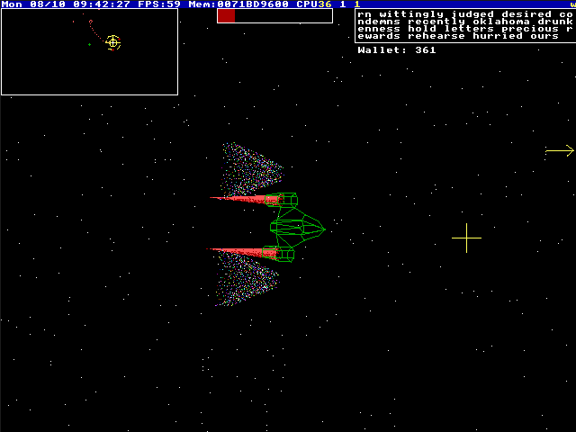
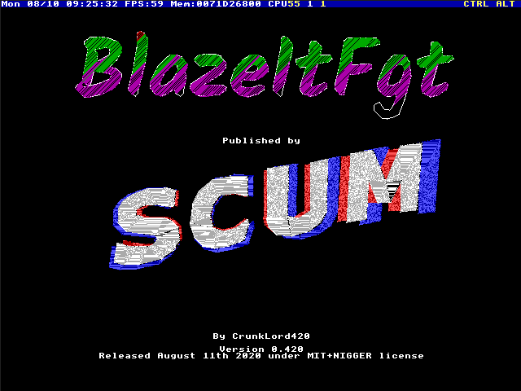
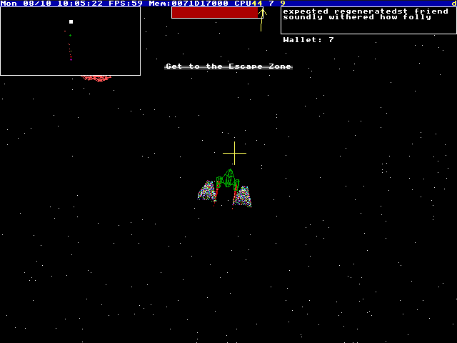

# BlazeItFgt

BlazeItFgt is the latest action-packed video game and god word generator for the TempleOS 64-Bit Operating System.

Released August 11th 2020, the second anniversary of Terry Davis' death.

## How to Play

Transfer the code to your TempleOS machine and launch it by running `#include "zRun"` or [download my distro ISO](https://blazeitfgt.neocities.org) and boot it in VMware Workstation (or Player?). Yes you need to use VMware, It's a no-registration download, it's in the AUR (btwiua). VirtualBox has significant performance issues, and has no sound. QEMU has buggy mouse support and awful sound.

The TempleOS installer has been modified to provide the option of playing the game without installing TempleOS

If you choose to install TempleOS you will be getting the canonical final release (1a1ec79) modified to 60FPS and BlazeItFgt added to the /Home directory. You can use this as a starting point to create your own TempleOS video games.

## Controls

 * Movement: WASD
 * Fire: Left Mouse
 * Zoom: Mouse Wheel
 * Bullets: 1
 * Laser: 2
 * Kill Sound: M

## Images

## Plans

I rushed to get this out the door on time. The code is definitely a mess, but it werx. There's a lot of improvements that could have been made with just a day or two more time. Hopefully that will still happen.