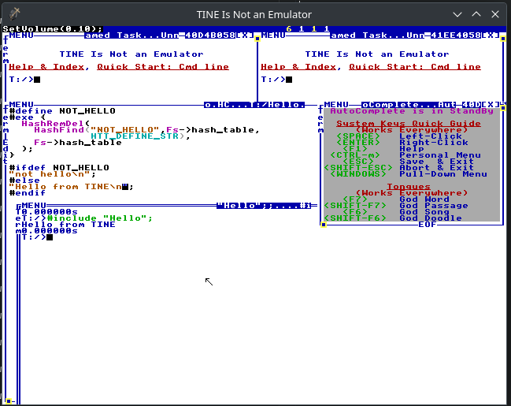

#  TINE Is Not a (TempleOS) Emulator
 \* *logo courtesy of CrunkLord420*

## features
- seamless filesystem integration, no mounting virtual disks or anything(primary annoyance when working with TOS)
- networking with FFI using the dyad library(powers builtin wiki)
- [wiki that guides you through HolyC and TempleOS](#documentation)

## required skills
 - knowledge of TempleOS
 - knowledge of C(HolyC specifically but you'll catch on easily)
 - (optional but recommended)knowledge of GDB/LLDB for debugging the loader(in case something goes wrong)

## system requirements
 - AMD64 architecture
 - Operating System: Linux, FreeBSD or Windows

# showcase


an example of HolyC/TempleOS' `#exe{}` and freedom of directly fiddling with system-level facilities mimicing `#undef` of ISO C

# **building**
## windows users
### only supports >=Win10(complain to msys2 devs not me), msvc unsupported
install msys2, launch the "MSYS2 MINGW64 Shell", and run the following
```
pacman -Syu make mingw-w64-x86_64-{cmake,gcc,SDL2}
```
if pacman tells you to restart the terminal then do it and run the cmd again
## unix-like system users
install SDL2, cmake, make and gcc/clang
## building the loader
```
mkdir build;
cd build;
cmake ..; # *nix ***THIS LINE ISNT FOR WINDOWS***
cmake .. -G 'MSYS Makefiles'; # ***WINDOWS***
make -j$(nproc);
```
side note: statically linking SDL2 on windows seems like std{in,out} gets borked so make sure to run the built binary in the mingw terminal to avoid dll hell
## build runtime
if you pull a newer commit then rebuild TINE and perform this step with `./tine -ctT BuildHCRT.HC;mv T/HCRT.BIN .`(if anyone wonders why i didnt add a custom cmake target for this, a breaking change in the loader/HCRT can produce a malformed/incompatible kernel which is a pain to fix)
```
./tine -f HCRT_BOOTSTRAP.BIN -ctT BuildHCRT.HC
mv T/HCRT.BIN .
```
# running
```
./tine -t T #-h for info on other flags
```
# changes from vanilla TempleOS
`Fs` and `Gs` are not `_intern` anymore, instead they are replaced by normal functions so `&Fs->member` must be replaced by `&(Fs->member)` <br>
The Windows key functionality has been replaced with the Alt key <br>
due to running in userspace, context switching is around 4 times slower(not that it matters anyway outside of flexing `CPURep(TRUE);` results) and ring 0 routines like In/OutU8 are not present <br>
division by zero is not an exception, it will bring up the debugger(SIGFPE)

# contributing
[read this](./contrib.md)

# documentation
```C
Cd("T:/Server");
#include "run";
//point browser to localhost:8080
```
contributions to wiki appreciated

# ref
```C
DirMk("folder");
Dir;
Dir("fold*");//supports wildcards
Cd("folder");
Man("Ed");
Ed("file.HC.Z");
Unzip("file.HC.Z");//unzip TempleOS compression
Zip("file.HC");
Find("str",,"-i");//grep -rn . -e str
FF("file.*");//find .|grep file
MountFile("Something.ISO.C");//MountFile(U8 *f,U8 drv_let='M');
Cd("M:/");//defaults to M
INT3;//force raise debugger
DbgHelp;//help on how to debug
ExitTINE(I32i ec=0);
```
